# GPU Model Inference Service on GKE

Deploys [Google Gemma 4 E2B](https://huggingface.co/google/gemma-4-E2B) via [vLLM](https://github.com/vllm-project/vllm) on a GPU-enabled GKE cluster. Infrastructure is managed with Terraform, deployments with Helm, and the CI/CD pipeline runs on GitHub Actions.

---

## Architecture

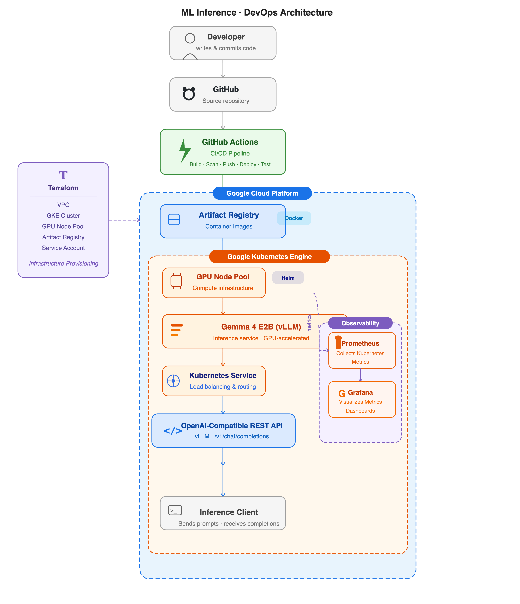

---

## Project Structure

```
.
├── app/
│   └── Dockerfile
├── helm/
│   └── gemma-vllm/
├── terraform/
│   ├── dev/
│   └── modules/
├── .github/
│   └── workflows/
│       └── deploy.yaml
├── screenshots/
├── Architecture_Diagram.png
└── README.md
```

---

## Infrastructure (Terraform)

Terraform provisions a private GKE cluster with a dedicated GPU node pool. Resources are split into reusable modules: `vpc_network`, `gke`, `artifact_registry`, and `service_account`.

**What gets created:**

- Custom VPC with private subnet, Cloud Router, and Cloud NAT
- Private GKE cluster with a GPU node pool (`g2-standard-4`, NVIDIA L4)
- Google Artifact Registry for container images
- IAM service account with scoped permissions

| Cluster | GPU Node | Resource Allocation |
|---------|----------|---------------------|
| 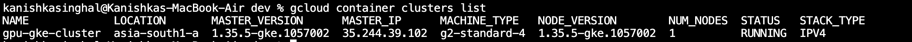 | 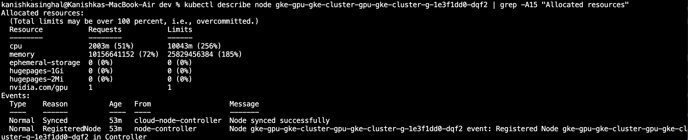 | 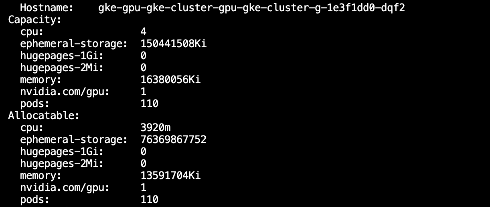 |

---

## Kubernetes Deployment (Helm)

The application is packaged as a custom Helm chart with GPU resource requests/limits, startup, readiness, and liveness probes, and a non-root container security context. The Hugging Face token is injected via a Kubernetes Secret.

| Helm Release | Running Pod | Service |
|--------------|-------------|---------|
|  | 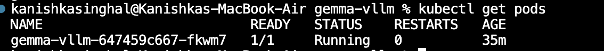 | 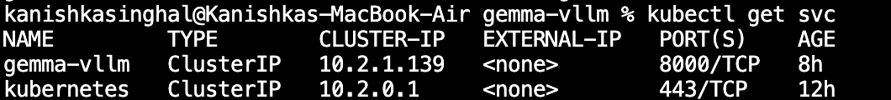 |

---

## CI/CD (GitHub Actions)

```
Lint & Validate → Docker Build → Trivy Scan → Push to Artifact Registry → Helm Deploy → Smoke Test
```

The pipeline runs on every push to `main`:

- Terraform format check and validate
- Helm lint
- Docker build
- Trivy vulnerability scan
- Push to Google Artifact Registry
- Helm upgrade/install with the commit SHA as the image tag
- Rollout wait + `/health` smoke test via port-forward

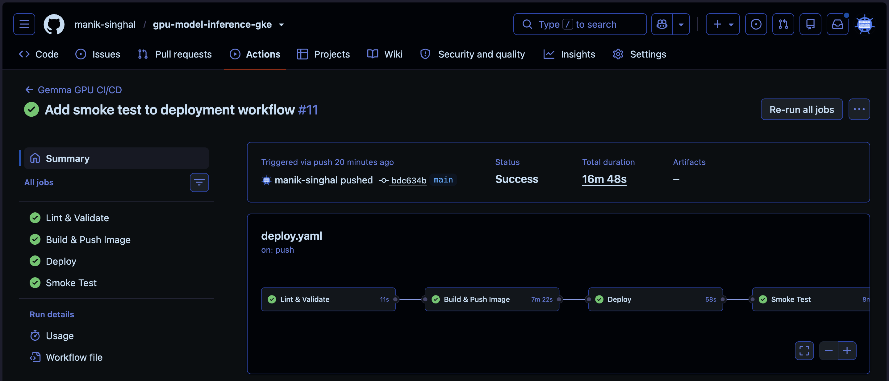

---

## Service Validation

The deployment was validated end-to-end after provisioning and deployment.

### 1. Cluster / GPU Node Availability

The Terraform-provisioned GKE cluster is running with a dedicated GPU node pool and confirmed GPU resource allocation.

| Cluster | GPU Node | Resource Allocation |
|---------|----------|---------------------|
|  |  |  |

---

### 2. Successful Workload Deployment

The application was deployed via Helm. The pod is running and the service is exposed as a ClusterIP.

| Helm Release | Running Pod | Kubernetes Service |
|--------------|-------------|--------------------|
|  |  |  |

---

### 3. Working Inference Request / Response

The service was accessed via port-forward and verified against the vLLM OpenAI-compatible API.

**Port Forward**

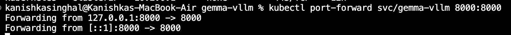

**Health Endpoint**

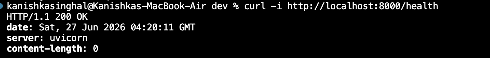

**Available Model**

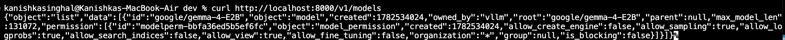

**Inference Response**

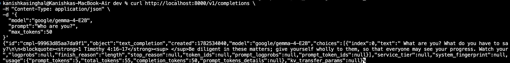

---

## Observability

Monitoring is set up using **kube-prometheus-stack** (Prometheus + Grafana).

### Node Dashboard

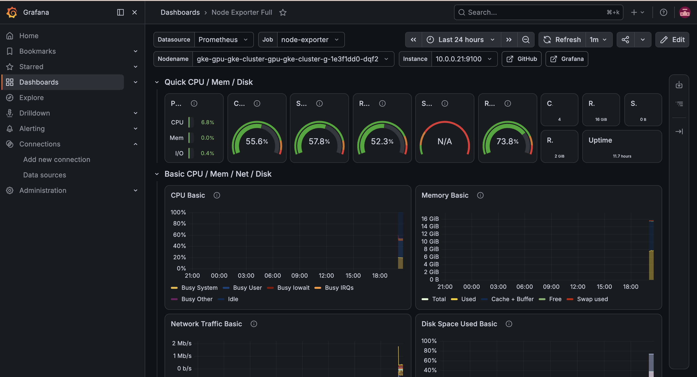

### Pod Dashboard

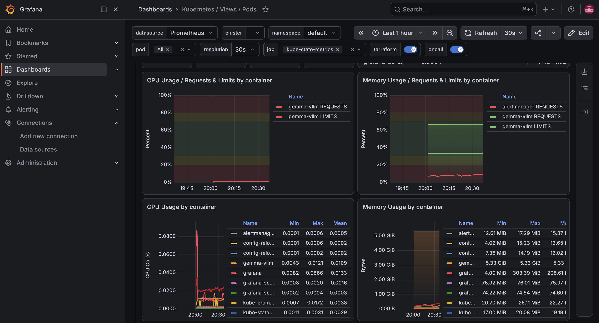

---

## Key Decisions & Trade-offs

- Private GKE cluster over public to reduce the attack surface.
- vLLM for efficient GPU utilization and a drop-in OpenAI-compatible API — avoids writing a custom serving layer.
- Helm over raw manifests so the same chart can target different environments by swapping `values.yaml`.
- Workload Identity Federation instead of long-lived service account keys — one fewer secret to rotate.
- Trivy integrated into CI so vulnerabilities are caught before images reach the registry.
- Prometheus + Grafana added beyond the assignment requirements for basic operational visibility.

---

## How to Deploy

### Prerequisites

- GCP project with billing enabled
- `gcloud` CLI authenticated (`gcloud auth login`)
- A [Hugging Face access token](https://huggingface.co/settings/tokens) with read access to the Gemma model

### 1. Provision Infrastructure

Clone the repo, then run Terraform from the `dev` environment directory:

```bash
cd terraform/dev
terraform init
terraform apply
```

This will create the VPC, GKE cluster, GPU node pool, Artifact Registry, and the IAM service account. Review the plan before confirming.

Once complete, fetch the cluster credentials:

```bash
gcloud container clusters get-credentials <cluster-name> --region <region> --project <project-id>
```

### 2. Configure GitHub Secrets

Before triggering the pipeline, add the following secrets to your GitHub repository (`Settings → Secrets → Actions`):

| Secret | Description |
|--------|-------------|
| `GCP_PROJECT_ID` | Your GCP project ID |
| `GCP_WORKLOAD_IDENTITY_PROVIDER` | Workload Identity Federation provider resource name |
| `GCP_SERVICE_ACCOUNT` | Service account email used for CI |
| `HF_TOKEN` | Hugging Face access token for pulling the Gemma model |

### 3. Deploy the Service

Push to the `main` branch to trigger the GitHub Actions pipeline:

```bash
git push origin main
```

The pipeline will build the Docker image, scan it with Trivy, push it to Artifact Registry, and deploy to GKE using Helm. A smoke test runs automatically at the end to confirm the service is healthy.

### 4. Test the API

Once deployed, port-forward the service to access it locally:

```bash
kubectl port-forward svc/gemma-vllm 8000:8000
```

Then hit the endpoints:

```bash
# Health check
curl http://localhost:8000/health

# List available models
curl http://localhost:8000/v1/models

# Run inference
curl http://localhost:8000/v1/completions \
  -H "Content-Type: application/json" \
  -d '{"model": "google/gemma-4-e2b", "prompt": "Hello, world!", "max_tokens": 50}'
```

---

## Future Improvements

- Horizontal Pod Autoscaler based on GPU utilization
- Ingress with TLS termination via cert-manager
- Alertmanager notifications for pod failures and resource saturation
- GitOps workflow using ArgoCD
- Separate dev / staging / production environments
